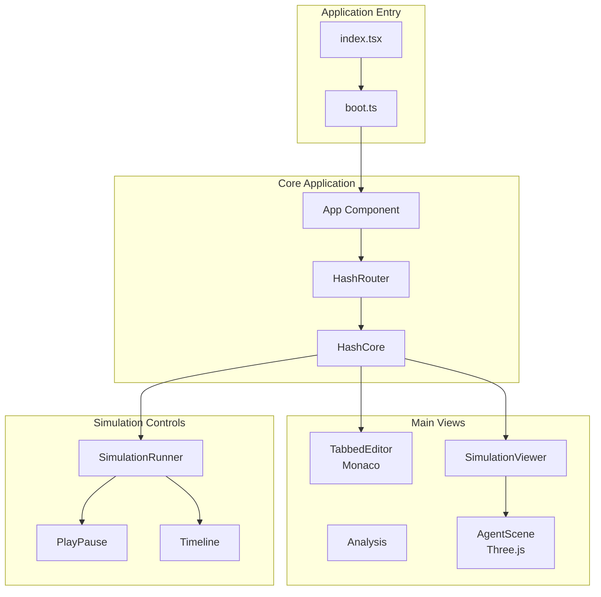
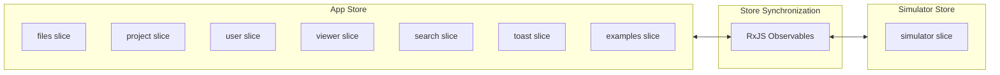
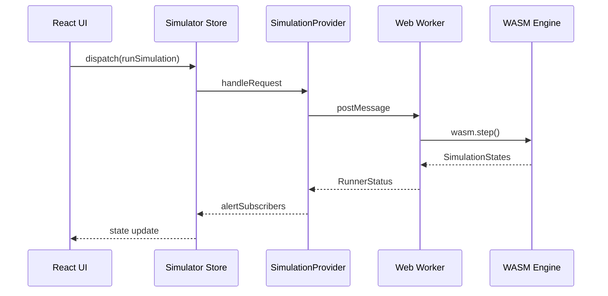
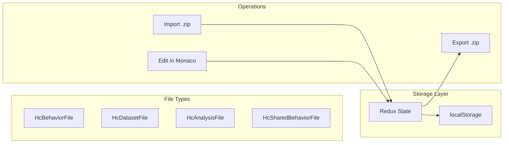
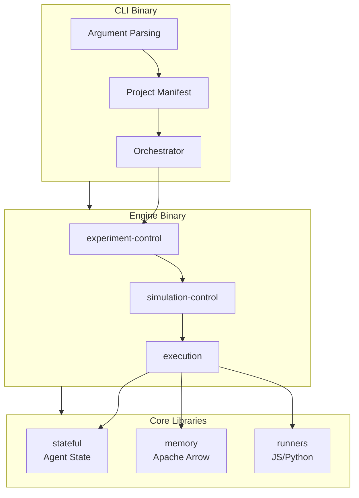

# HASH Labs Architecture

This document provides detailed technical architecture documentation for the HASH Labs monorepo, with a focus on **sim-core** (hCore), the React/TypeScript simulation IDE.

## Table of Contents

- [Repository Overview](#repository-overview)
- [sim-core Architecture](#sim-core-architecture)
  - [Application Structure](#application-structure)
  - [State Management](#state-management)
  - [Component Architecture](#component-architecture)
  - [Engine Integration](#engine-integration)
  - [Data Flow](#data-flow)
- [sim-engine Architecture](#sim-engine-architecture)
- [Key Files Reference](#key-files-reference)
- [Feature Development Guide](#feature-development-guide)
- [Common Patterns](#common-patterns)

---

## Repository Overview

```
hashintel-labs/
├── apps/
│   ├── sim-core/                    # Primary: React/TypeScript simulation IDE
│   │   ├── packages/
│   │   │   ├── core/                # Main frontend application (1167 files)
│   │   │   ├── engine/              # Legacy Rust simulation engine (WASM)
│   │   │   ├── engine-web/          # WASM bindings and TypeScript API
│   │   │   ├── sim-engine-types/    # Shared Rust types
│   │   │   └── utils/               # Shared utilities
│   │   └── example_projects/        # Sample simulation projects (.zip)
│   ├── sim-engine/                  # Standalone Rust simulation engine
│   │   ├── bin/                     # CLI and engine binaries
│   │   ├── lib/                     # Core library crates
│   │   ├── stdlib/                  # Standard library (JS/Python)
│   │   └── tests/                   # Integration tests
│   └── sim-core-plugins/            # hCore plugins
│       └── process-modeler/         # Business process modeling plugin
└── pocs/                            # Proof of concepts
    ├── hash-agents/                 # Python LLM agents (LangChain/FastAPI)
    ├── distributed_collab/          # Elixir distributed system
    └── hash_helm_chart/             # Kubernetes Helm charts
```

---

## sim-core Architecture

### Application Structure



#### Entry Points

**`src/index.tsx`** - Application bootstrap:
```typescript
// 1. Handle version caching for staging
// 2. Call boot() to initialize services
// 3. Render React app with Redux Provider
```

**`src/boot.ts`** - Service initialization:
```typescript
export const boot = async (forExperiments: boolean) => {
  configureTheme();                          // CSS variables
  enableMapSet();                            // Immer support
  configureMonaco();                         // Code editor
  buildSimulationProvider(forExperiments);   // WASM workers
  syncStores(store, simulatorStore);         // Redux sync
};
```

> **Note**: `initSentry()` and `why-did-you-render` were removed as part of the local-first migration (Phase 1).

### State Management

sim-core uses **two Redux stores** for performance optimization - a pattern used when one store requires high-frequency updates.



#### App Store (`src/features/store.ts`)

Handles general UI state with standard middleware:

```typescript
export const store = configureStore({
  reducer: rootReducer,  // Combined from 7 feature slices
  middleware: (getDefaultMiddleware) =>
    getDefaultMiddleware({ serializableCheck: { /* ... */ } })
      .prepend([queueMiddleware])        // Action queuing
      .concat([
        localStorageMiddleware,          // Persistence
        trackingMiddleware,              // Analytics
        analysisMiddleware,              // Analysis updates
        observeMiddleware(observable),   // RxJS bridge
      ]),
});
```

**Feature Slices:**

| Slice | Purpose | Key State |
|-------|---------|-----------|
| `files` | File management | `entities`, `currentFileId`, `openFileIds` |
| `project` | Project state | `current`, `canEdit`, `accessGate` |
| `user` | User data | `currentUser`, `tourProgress`, `isLoggedIn` |
| `viewer` | UI state | `tabs`, `activityVisible`, `editorVisible` |
| `search` | Search state | `query`, `results` |
| `toast` | Notifications | `toasts` |
| `examples` | Example projects | `examples`, `loaded` |

#### Simulator Store (`src/features/simulator/store.ts`)

Dedicated high-performance store for simulation state:

```typescript
export const simulatorStore = configureStore({
  reducer: { simulator },
  devTools: false,  // Disabled for performance
  middleware: (getDefaultMiddleware) =>
    getDefaultMiddleware({
      immutableCheck: false,      // Disabled for performance
      serializableCheck: false,   // Disabled for performance
    }).concat([
      simulatorMiddleware,
      observeMiddleware(simulatorStoreActionObservable),
      simulatorAnalysisMiddleware,
    ]),
});
```

**Simulator State:**

| Property | Type | Purpose |
|----------|------|---------|
| `simulations` | `Record<string, SimulationData>` | All simulation runs |
| `currentSimulation` | `string \| null` | Active simulation ID |
| `analysisMode` | `AnalysisMode` | Current analysis view |
| `history` | `EntityState` | Project history items |
| `stepsPerSecond` | `number` | Playback speed |

#### Store Synchronization (`src/features/simulator/simulate/sync.ts`)

RxJS observables synchronize state between stores:

```typescript
export const syncStores = (appStore, simulatorStore) => {
  // Project changes → reset simulation
  projectChangeObservable(appStore).subscribe((projectUrl) => {
    simulatorStore.dispatch(resetSimulationDataAndHistory(...));
  });

  // Globals changes → update runner (when running)
  appStoreObservable.pipe(
    map(selectGlobals),
    distinctUntilChanged(),
    filter((globals) => typeof globals === "string"),
  ).subscribe(...);

  // Tab changes → update analysis visibility
  appStoreObservable.pipe(
    map(selectCurrentTab),
    distinctUntilChanged()
  ).subscribe((tab) => {
    simulatorStore.dispatch(setAnalysisVisible(tab === TabKind.Analysis));
  });
};
```

### Component Architecture

#### Directory Structure

```
src/components/
├── HashCore/           # Main IDE shell (148 files)
│   ├── HashCore.tsx    # Root component
│   ├── Header/         # Top navigation bar
│   ├── Main/           # Main content area
│   ├── Files/          # File tree and management
│   ├── AccessGate/     # Permission checks
│   └── Tour/           # Onboarding tour
├── SimulationRunner/   # Playback controls (23 files)
│   ├── SimulationRunner.tsx
│   └── Controls/       # PlayPause, Reset, Timeline, etc.
├── AgentScene/         # 3D visualization (17 files)
│   ├── AgentScene.tsx  # Three.js scene
│   └── README.md       # Visualization docs
├── TabbedEditor/       # Monaco integration (12 files)
├── Modal/              # Dialog system (116 files)
├── Analysis/           # Analysis views (17 files)
└── PlotViewer/         # Plotly charts (13 files)
```

#### Key Components

**HashCore** (`src/components/HashCore/HashCore.tsx`):
```typescript
export const HashCore: FC = memo(function HashCore() {
  const dispatch = useDispatch();
  const project = useSelector(selectCurrentProject);
  const accessGate = useSelector(selectAccessGate);
  
  useParameterisedUi();     // URL parameter handling
  useKeyboardShortcuts();   // Global shortcuts
  useSaveOrFork();          // Cmd+S handling
  useShouldUnload();        // Unsaved changes warning

  return (
    <>
      <HashCoreAccessGate accessGate={accessGate}>
        <HashCoreHeader />
        <HashCoreMain />
      </HashCoreAccessGate>
      <ToastManager />
      <HashCoreTour />
    </>
  );
});
```

**SimulationRunner** (`src/components/SimulationRunner/SimulationRunner.tsx`):
```typescript
export const SimulationRunner: FC = () => {
  const dispatch = useSimulatorDispatch();  // Note: uses simulator store

  useKeyboardShortcuts({
    meta: { Enter: () => dispatch(toggleCurrentSimulator()) },
    alt: { Enter: () => dispatch(pauseAndNew()) },
    metaShift: { Enter: () => dispatch(stepSimulator()) },
  });

  return (
    <div className="SimulationRunner">
      <Reset />
      <ExperimentsRunner />
      <StepButton />
      <PlayPause />
      <Timeline />
    </div>
  );
};
```

### Engine Integration



#### SimulationProvider (`src/features/simulator/simulate/provider.ts`)

Manages connections to simulation runners:

```typescript
export class SimulationProvider implements ExperimentRunner {
  targets: Record<ProviderTargetEnv, ProviderTarget> | null = null;
  
  build(workerFileName: string, numWorkers = 4, devMode = false) {
    const dedicatedRunner = new WebWorkerRunner(
      "worker-web-dedicated",
      workerFileName,
      devMode
    );

    this.targets = {
      web: {
        target: "web",
        dedicatedRunner,
        experimentRunners: new Map([
          ["experimenter-web-0", new WebExperimentRunner(numWorkers, devMode, workerFileName)],
        ]),
      },
      cloud: {
        target: "cloud",
        dedicatedRunner,
        experimentRunners: new Map(),
      },
    };
  }
}
```

#### Web Worker (`src/workers/simulation-worker/index.ts`)

Runs WASM engine in background thread:

```typescript
import { RunnerState, WasmRequestHandler, wasm } from "@hashintel/engine-web";

const runner: Promise<RunnerState> = (async () => ({
  wasmlib: await wasm(),      // Load WASM module
  datasetCache: new Map(),
  pyodide: null,              // Python runtime (lazy loaded)
  parsedSimulation: null,
  running: false,
  stepsLeft: 0,
  // ... more state
}))();

RegisterPromiseWorker(async (message) => {
  return typeof message === "object"
    ? await WasmRequestHandler(message, await runner)
    : null;
});
```

### Data Flow

#### File System Abstraction

Simulations use a virtual file system stored in Redux:



**File Types** (`src/features/files/types.ts`):

| Type | Kind | Purpose |
|------|------|---------|
| `HcBehaviorFile` | `Behavior` | Agent behaviors (JS/Python) |
| `HcSharedBehaviorFile` | `SharedBehavior` | Dependencies from hIndex |
| `HcDatasetFile` | `Dataset` | JSON/CSV data files |
| `HcAnalysisFile` | `Analysis` | Analysis definitions |

---

## sim-engine Architecture

The standalone Rust simulation engine:



### Library Crates

| Crate | Purpose |
|-------|---------|
| `execution` | Simulation execution logic, runner management |
| `experiment-control` | Experiment lifecycle management |
| `experiment-structure` | Configuration and manifest parsing |
| `simulation-control` | Individual simulation management |
| `stateful` | Agent state and field management |
| `memory` | Apache Arrow-based memory management |
| `flatbuffers_gen` | Generated FlatBuffers types |
| `nano` | IPC communication |
| `orchestrator` | Process orchestration |

---

## Key Files Reference

### Entry Points

| File | Purpose |
|------|---------|
| `apps/sim-core/packages/core/src/index.tsx` | React app entry |
| `apps/sim-core/packages/core/src/boot.ts` | Service initialization |
| `apps/sim-engine/bin/cli/src/main.rs` | CLI entry |
| `apps/sim-engine/bin/hash_engine/src/main.rs` | Engine entry |

### State Management

| File | Purpose |
|------|---------|
| `src/features/store.ts` | App Redux store configuration |
| `src/features/rootReducer.ts` | Combined app reducers |
| `src/features/simulator/store.ts` | Simulator Redux store |
| `src/features/simulator/simulate/slice.ts` | Simulator slice (1800+ lines) |
| `src/features/simulator/simulate/sync.ts` | Store synchronization |
| `src/features/files/slice.ts` | File management slice (1200+ lines) |
| `src/features/project/slice.ts` | Project state slice |

### Components

| Directory | Purpose | Files |
|-----------|---------|-------|
| `src/components/HashCore/` | Main IDE shell | 148 |
| `src/components/SimulationRunner/` | Playback controls | 23 |
| `src/components/AgentScene/` | 3D visualization | 17 |
| `src/components/Modal/` | Dialog system | ~80 |
| `src/components/TabbedEditor/` | Code editor | 12 |

### Engine Integration

| File | Purpose |
|------|---------|
| `src/features/simulator/simulate/provider.ts` | Simulation runner management |
| `src/features/simulator/simulate/buildprovider.ts` | Worker initialization |
| `src/workers/simulation-worker/index.ts` | WASM worker |
| `packages/engine-web/src/` | WASM bindings |

---

## Feature Development Guide

> **IMPORTANT**: Redux is scheduled for removal. Do NOT add new Redux slices, selectors, or thunks.
> For new features, use React local state (`useState`), Context, or simple module-level state.
> See [TODO.md](TODO.md) for the full migration plan.

### Legacy Pattern: Redux Slice (DO NOT ADD NEW ONES)

The following shows the existing Redux patterns for reference when working with current code:

1. **Create the Redux slice** (LEGACY — do not add new ones):

```typescript
// src/features/myFeature/slice.ts
import { createSlice, PayloadAction } from "@reduxjs/toolkit";

export const { reducer: myFeatureReducer, actions } = createSlice({
  name: "myFeature",
  initialState: { /* ... */ },
  reducers: {
    doSomething(state, action: PayloadAction<string>) {
      state.value = action.payload;
    },
  },
});
```

2. **Add to root reducer**:

```typescript
// src/features/rootReducer.ts
import { myFeatureReducer } from "./myFeature/slice";

export const rootReducer = combineReducers({
  // existing slices...
  myFeature: myFeatureReducer,
});
```

3. **Create selectors**:

```typescript
// src/features/myFeature/selectors.ts
import { RootState } from "../types";

export const selectMyFeatureValue = (state: RootState) => 
  state.myFeature.value;
```

4. **Create components**:

```typescript
// src/components/MyFeature/MyFeature.tsx
import React, { FC } from "react";
import { useSelector, useDispatch } from "react-redux";
import { selectMyFeatureValue } from "../../features/myFeature/selectors";
import { actions } from "../../features/myFeature/slice";
import "./MyFeature.scss";

export const MyFeature: FC = () => {
  const dispatch = useDispatch();
  const value = useSelector(selectMyFeatureValue);
  
  return (
    <div className="MyFeature">
      {/* ... */}
    </div>
  );
};
```

5. **Add styling**:

```scss
// src/components/MyFeature/MyFeature.scss
.MyFeature {
  // Use theme CSS variables
  color: var(--theme-dark);
  background: var(--theme-light);
}
```

---

## Common Patterns

### Navigation / Routing

The app uses custom lightweight routing utilities (replacing the abandoned `hookrouter` package):

```typescript
// Programmatic navigation (works in components, thunks, or any code)
import { navigate, setQueryParams } from "../util/navigation";

navigate("/path/to/page");                    // Push navigation
navigate("/path", true);                      // Replace current entry
navigate("/path", false, { key: "value" });   // With query params

setQueryParams({ view: "3d" });               // Update query params only

// Route matching in components
import { usePathRouter, RouteMap } from "../util/usePathRouter";

const routes: RouteMap = {
  "/": () => <Home />,
  "/project/:id": ({ id }) => <Project id={id} />,
  "/@*": () => <ProjectByPath />,
};

const element = usePathRouter(routes);
```

### Using the Correct Store

```typescript
// For app state (files, project, UI)
import { useSelector, useDispatch } from "react-redux";
const dispatch = useDispatch();
const project = useSelector(selectCurrentProject);

// For simulation state
import { useSimulatorSelector, useSimulatorDispatch } from "../../features/simulator/context";
const simulatorDispatch = useSimulatorDispatch();
const running = useSimulatorSelector(selectRunning);
```

### Async Actions with createAppAsyncThunk

```typescript
// src/features/myFeature/thunks.ts
import { createAppAsyncThunk } from "../createAppAsyncThunk";

export const fetchData = createAppAsyncThunk<ReturnType, ArgType>(
  "myFeature/fetchData",
  async (arg, { getState, signal }) => {
    const response = await api.fetch(arg, signal);
    return response.data;
  }
);
```

### Observable-based Side Effects

```typescript
// Using RxJS for complex async flows
import { filter, map, distinctUntilChanged } from "rxjs/operators";
import { fromStore } from "../../util/fromStore";

fromStore(store)
  .pipe(
    map(selectSomeValue),
    distinctUntilChanged(),
    filter((value) => value !== null)
  )
  .subscribe((value) => {
    // React to changes
  });
```

### Modal System

```typescript
// Using the modal hook
import { useModal } from "react-modal-hook";

const [showModal, hideModal] = useModal(() => (
  <ModalBase onClose={hideModal}>
    <ModalHeader>Title</ModalHeader>
    <ModalContent>Content</ModalContent>
    <ModalFooter>
      <Button onClick={hideModal}>Close</Button>
    </ModalFooter>
  </ModalBase>
));
```

---

## Additional Resources

- [sim-core README](apps/sim-core/README.md) - Setup and running instructions
- [sim-engine README](apps/sim-engine/README.md) - Rust engine documentation
- [TODO.md](TODO.md) - Technical debt and modernization roadmap
- [CONTRIBUTING.md](.github/CONTRIBUTING.md) - Contribution guidelines
- [.cursor/rules/hash-labs.mdc](.cursor/rules/hash-labs.mdc) - AI agent guidelines
- [HASH Documentation](https://hash.ai/docs/simulation) - User-facing docs
