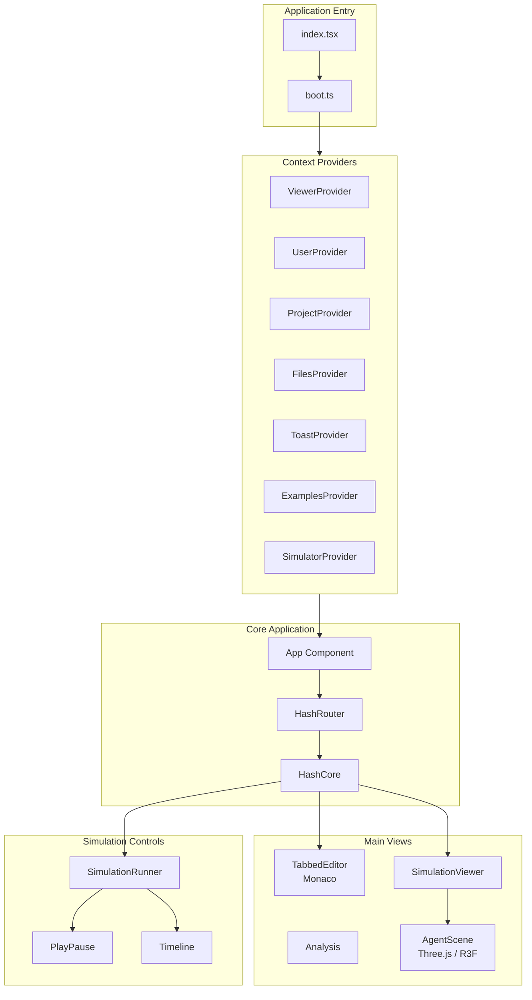
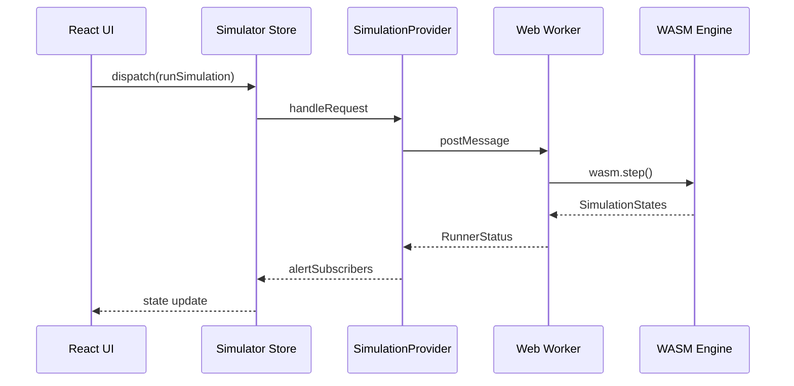
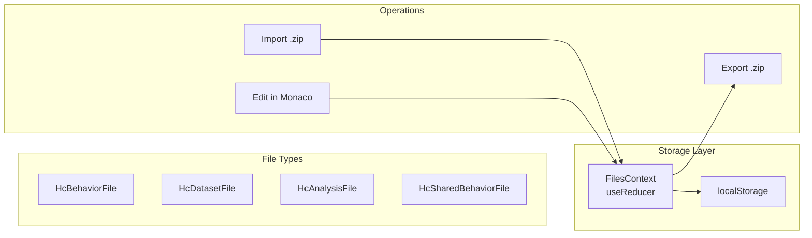
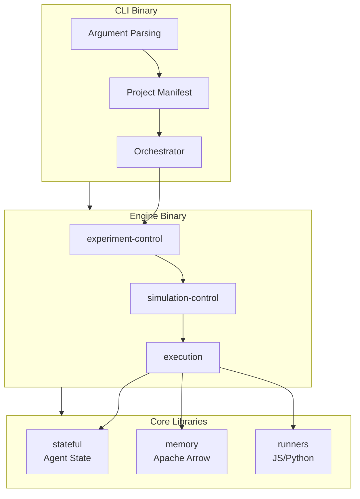

# HASH Labs Architecture

This document provides detailed technical architecture documentation for the HASH Labs monorepo, with a focus on **sim-core** (hCore), a free, fully-featured, local-first simulation IDE.

## Table of Contents

- [Repository Overview](#repository-overview)
- [sim-core Architecture](#sim-core-architecture)
  - [Application Structure](#application-structure)
  - [Build System](#build-system)
  - [State Management](#state-management)
  - [Component Architecture](#component-architecture)
  - [Engine Integration](#engine-integration)
  - [Data Flow](#data-flow)
- [sim-engine Architecture](#sim-engine-architecture)
- [Key Files Reference](#key-files-reference)
- [Feature Development Guide](#feature-development-guide)
- [Common Patterns](#common-patterns)

---

## Repository Overview

```
hashintel-labs/
├── apps/
│   ├── sim-core/                    # Primary: React/TypeScript simulation IDE
│   │   ├── packages/
│   │   │   ├── core/                # Main frontend application
│   │   │   ├── engine/              # Legacy Rust simulation engine (WASM)
│   │   │   ├── engine-web/          # WASM bindings and TypeScript API
│   │   │   ├── sim-engine-types/    # Shared Rust types
│   │   │   └── utils/               # Shared utilities
│   │   └── example_projects/        # Sample simulation projects (.zip)
│   ├── sim-engine/                  # Standalone Rust simulation engine
│   │   ├── bin/                     # CLI and engine binaries
│   │   ├── lib/                     # Core library crates
│   │   ├── stdlib/                  # Standard library (JS/Python)
│   │   └── tests/                   # Integration tests
│   └── sim-core-plugins/            # hCore plugins
│       └── process-modeler/         # Business process modeling plugin
└── pocs/                            # Proof of concepts
    ├── hash-agents/                 # Python LLM agents (LangChain/FastAPI)
    ├── distributed_collab/          # Elixir distributed system
    └── hash_helm_chart/             # Kubernetes Helm charts
```

---

## sim-core Architecture

### Application Structure



#### Entry Points

**`src/index.tsx`** — Application bootstrap:
```typescript
// 1. Handle version caching for staging
// 2. Call boot() to initialize services
// 3. Render React app wrapped in Context Providers
```

**`src/boot.ts`** — Service initialization:
```typescript
export const boot = async (forExperiments: boolean) => {
  configureTheme();                          // CSS variables
  enableMapSet();                            // Immer support
  configureMonaco();                         // Code editor
  buildSimulationProvider(forExperiments);   // WASM workers
};
```

### Build System

sim-core uses **Vite 7** for both development and production builds:

| Tool | Version | Purpose |
|------|---------|---------|
| Vite | 7.3 | Dev server + production bundler (Rollup) |
| TypeScript | 5.3 | Type checking |
| Babel | 7 | Jest test transformation |
| Jest | 29.7 | Unit tests (118 suites, 310 tests) |
| Playwright | — | E2E tests (66 tests across 8 spec files) |
| Node.js | 24 LTS | Runtime |

Key config files:
- `vite.config.ts` — Vite config with WASM, Monaco, and React plugins
- `tsconfig.json` — TypeScript config (strict mode, `useUnknownInCatchVariables: true`)
- `babel.config.js` — Babel presets for Jest (React, Env, TypeScript)
- `playwright.config.ts` — E2E test configuration

### State Management

sim-core uses **React built-in state management** (Context + hooks) for all application state, with a lightweight custom store for the performance-critical simulator.

```mermaid
flowchart LR
    subgraph AppContexts[React Context Providers]
        direction TB
        Files[FilesContext<br/>useReducer + Immer]
        Project[ProjectContext<br/>useReducer]
        User[UserContext<br/>useReducer]
        Viewer[ViewerContext<br/>useReducer]
        Search[SearchContext<br/>useState]
        Toast[ToastContext<br/>useState]
        Examples[ExamplesContext<br/>useState]
    end
    
    subgraph SimStore[Simulator Store]
        direction TB
        Simulator[SimpleStore<br/>reduxCompat.ts]
        Middleware[middleware chain]
        Subscribers[store subscribers]
    end
    
    subgraph Sync[Context → Store Sync]
        StoreSync[StoreSync component<br/>useEffect hooks]
    end
    
    AppContexts --> StoreSync
    StoreSync --> SimStore
```



#### App State (React Context)

All general UI state is managed through React Context providers. Each provider is pure React with no external dependencies:

| Context | Hook | State Mechanism | Purpose |
|---------|------|-----------------|---------|
| `FilesContext` | `useFiles()` | `useReducer` + Immer | File tree, open files, editor state |
| `ProjectContext` | `useProject()` | `useReducer` | Current project, access gates |
| `UserContext` | `useUser()` | `useReducer` | Tour progress, preferences |
| `ViewerContext` | `useViewer()` | `useReducer` | Tabs, editor/activity visibility |
| `SearchContext` | `useSearch()` | `useState` | Search query state |
| `ToastContext` | `useToast()` | `useState` | Toast notifications |
| `ExamplesContext` | `useExamples()` | `useState` | Example project list |

#### Simulator Store (`src/features/simulator/store.ts`)

The simulator uses a lightweight custom store (`reduxCompat.ts`) for high-frequency simulation updates. This store provides Redux-compatible APIs (`dispatch`, `getState`, `subscribe`) without the Redux dependency:

```typescript
import { createStore } from "../reduxCompat";

export const simulatorStore = createStore(rootReducer, [
  simulatorMiddleware,        // Provider message handling
  observeMiddleware(...),     // Action observability
  simulatorAnalysisMiddleware // Plot data computation
]);
```

Components access simulation state via `useSyncExternalStore`:

```typescript
import { useSimulatorSelector, useSimulatorDispatch } from "../features/simulator/context";

const running = useSimulatorSelector(selectRunning);
const dispatch = useSimulatorDispatch();
```

**Simulator State:**

| Property | Type | Purpose |
|----------|------|---------|
| `simulationData` | `Record<string, SimulationData>` | All simulation runs |
| `currentSimulation` | `string \| null` | Active simulation ID |
| `analysisMode` | `AnalysisMode` | Current analysis view |
| `history` | Entity state | Project history items |
| `stepsPerSecond` | `number` | Playback speed |

#### Context ↔ Store Synchronization

The `StoreSync` component (`src/features/simulator/simulate/StoreSync.tsx`) bridges React contexts to the simulator store using `useEffect` hooks:

- Project changes → reset simulation
- Globals file changes → update runner (when running)
- Tab changes → toggle analysis visibility
- Analysis source changes → clear cached plot data

#### Compatibility Layer (`src/features/reduxCompat.ts`)

A thin utility providing Redux-compatible APIs using only Immer and Reselect:

| API | Purpose |
|-----|---------|
| `createSlice` | Generates reducer + action creators (Immer-wrapped) |
| `createAction` | Typed action creator with `.type` and `.match()` |
| `createEntityAdapter` | Sorted entity CRUD with selectors |
| `createStore` | Minimal store with middleware chain + thunk support |
| `createSelector` | Re-exported from Reselect |

### Component Architecture

#### Directory Structure

```
src/components/
├── HashCore/           # Main IDE shell
│   ├── HashCore.tsx    # Root component
│   ├── Header/         # Top navigation bar
│   ├── Main/           # Main content area
│   ├── Files/          # File tree and management
│   ├── AccessGate/     # Permission checks
│   └── Tour/           # Onboarding tour
├── SimulationRunner/   # Playback controls
│   ├── SimulationRunner.tsx
│   └── Controls/       # PlayPause, Reset, Timeline, etc.
├── AgentScene/         # 3D visualization (@react-three/fiber)
│   ├── AgentScene.tsx  # Three.js scene
│   └── README.md       # Visualization docs
├── TabbedEditor/       # Monaco integration
├── Modal/              # Dialog system
├── Analysis/           # Analysis views
└── PlotViewer/         # Plotly charts
```

#### Key Components

**HashCore** (`src/components/HashCore/HashCore.tsx`):
```typescript
export const HashCore: FC = memo(function HashCore() {
  const { currentProject } = useProject();
  const { accessGate } = useProject();
  
  useParameterisedUi();     // URL parameter handling
  useKeyboardShortcuts();   // Global shortcuts
  useSaveOrFork();          // Cmd+S handling
  useShouldUnload();        // Unsaved changes warning

  return (
    <>
      <HashCoreAccessGate accessGate={accessGate}>
        <HashCoreHeader />
        <HashCoreMain />
      </HashCoreAccessGate>
      <ToastManager />
      <HashCoreTour />
    </>
  );
});
```

**SimulationRunner** (`src/components/SimulationRunner/SimulationRunner.tsx`):
```typescript
export const SimulationRunner: FC = () => {
  const dispatch = useSimulatorDispatch();

  useKeyboardShortcuts({
    meta: { Enter: () => dispatch(toggleCurrentSimulator()) },
    alt: { Enter: () => dispatch(pauseAndNew()) },
    metaShift: { Enter: () => dispatch(stepSimulator()) },
  });

  return (
    <div className="SimulationRunner">
      <Reset />
      <ExperimentsRunner />
      <StepButton />
      <PlayPause />
      <Timeline />
    </div>
  );
};
```

### Engine Integration



#### SimulationProvider (`src/features/simulator/simulate/provider.ts`)

Manages connections to simulation runners:

```typescript
export class SimulationProvider implements ExperimentRunner {
  targets: Record<ProviderTargetEnv, ProviderTarget> | null = null;
  
  build(workerFileName: string, numWorkers = 4, devMode = false) {
    const dedicatedRunner = new WebWorkerRunner(
      "worker-web-dedicated", workerFileName, devMode
    );
    this.targets = {
      web: {
        target: "web",
        dedicatedRunner,
        experimentRunners: new Map([
          ["experimenter-web-0", new WebExperimentRunner(numWorkers, devMode, workerFileName)],
        ]),
      },
    };
  }
}
```

#### Web Worker (`src/workers/simulation-worker/index.ts`)

Runs WASM engine in background thread:

```typescript
import { RunnerState, WasmRequestHandler, wasm } from "@hashintel/engine-web";

const runner: Promise<RunnerState> = (async () => ({
  wasmlib: await wasm(),      // Load WASM module
  datasetCache: new Map(),
  pyodide: null,              // Python runtime (lazy loaded)
  parsedSimulation: null,
  running: false,
  stepsLeft: 0,
}))();

RegisterPromiseWorker(async (message) => {
  return typeof message === "object"
    ? await WasmRequestHandler(message, await runner)
    : null;
});
```

### Data Flow

#### File System Abstraction

Simulations use a virtual file system stored in React Context:



**File Types** (`src/features/files/types.ts`):

| Type | Kind | Purpose |
|------|------|---------|
| `HcBehaviorFile` | `Behavior` | Agent behaviors (JS/Python) |
| `HcSharedBehaviorFile` | `SharedBehavior` | Dependencies from hIndex |
| `HcDatasetFile` | `Dataset` | JSON/CSV data files |
| `HcAnalysisFile` | `Analysis` | Analysis definitions |

---

## sim-engine Architecture

The standalone Rust simulation engine:



### Library Crates

| Crate | Purpose |
|-------|---------|
| `execution` | Simulation execution logic, runner management |
| `experiment-control` | Experiment lifecycle management |
| `experiment-structure` | Configuration and manifest parsing |
| `simulation-control` | Individual simulation management |
| `stateful` | Agent state and field management |
| `memory` | Apache Arrow-based memory management |
| `flatbuffers_gen` | Generated FlatBuffers types |
| `nano` | IPC communication |
| `orchestrator` | Process orchestration |

---

## Key Files Reference

### Entry Points

| File | Purpose |
|------|---------|
| `apps/sim-core/packages/core/src/index.tsx` | React app entry |
| `apps/sim-core/packages/core/src/boot.ts` | Service initialization |
| `apps/sim-engine/bin/cli/src/main.rs` | CLI entry |
| `apps/sim-engine/bin/hash_engine/src/main.rs` | Engine entry |

### State Management

| File | Purpose |
|------|---------|
| `src/features/files/FilesContext.tsx` | File state (useReducer + Immer reducer) |
| `src/features/files/slice.ts` | Files reducer and action creators |
| `src/features/files/adapter.ts` | Pure entity adapter for file CRUD |
| `src/features/project/ProjectContext.tsx` | Project state (useReducer) |
| `src/features/viewer/ViewerContext.tsx` | Viewer/UI state (useReducer) |
| `src/features/user/UserContext.tsx` | User preferences (useReducer) |
| `src/features/toast/ToastContext.tsx` | Toast notifications (useState) |
| `src/features/search/SearchContext.tsx` | Search state (useState) |
| `src/features/examples/ExamplesContext.tsx` | Examples list (useState) |
| `src/features/simulator/store.ts` | Simulator store (SimpleStore) |
| `src/features/simulator/simulate/slice.ts` | Simulator reducer (1800+ lines) |
| `src/features/simulator/simulate/StoreSync.tsx` | Context → store sync |
| `src/features/reduxCompat.ts` | Redux-compatible utilities |

### Components

| Directory | Purpose |
|-----------|---------|
| `src/components/HashCore/` | Main IDE shell |
| `src/components/SimulationRunner/` | Playback controls |
| `src/components/AgentScene/` | 3D visualization (@react-three/fiber) |
| `src/components/Modal/` | Dialog system |
| `src/components/TabbedEditor/` | Code editor (Monaco) |
| `src/components/Analysis/` | Analysis views |
| `src/components/PlotViewer/` | Plotly charts |

### Engine Integration

| File | Purpose |
|------|---------|
| `src/features/simulator/simulate/provider.ts` | Simulation runner management |
| `src/features/simulator/simulate/buildprovider.ts` | Worker initialization |
| `src/workers/simulation-worker/index.ts` | WASM worker |
| `packages/engine-web/src/` | WASM bindings |

---

## Feature Development Guide

### Adding New State

Use React's built-in state management. Choose the simplest approach that works:

```typescript
// 1. Local state (preferred — use when state is component-local)
const [value, setValue] = useState(initialValue);

// 2. Shared state via Context (use when state crosses component boundaries)
const { currentProject } = useProject();
const { allFiles, updateFile } = useFiles();

// 3. localStorage for persistence
localStorage.setItem('preferences', JSON.stringify(prefs));
```

**Do NOT** add new state management libraries. The project uses only React built-ins plus a thin compatibility layer (`reduxCompat.ts`) for the simulator store.

### Adding New Components

Follow the existing `src/components/[Name]/` structure:

```typescript
// src/components/MyFeature/MyFeature.tsx
import React, { FC } from "react";
import { useFiles } from "../../features/files/FilesContext";
import { useProject } from "../../features/project/ProjectContext";
import "./MyFeature.scss";

export const MyFeature: FC = () => {
  const { currentFile } = useFiles();
  const { currentProject } = useProject();
  
  return (
    <div className="MyFeature">
      {/* ... */}
    </div>
  );
};
```

```scss
// src/components/MyFeature/MyFeature.scss
.MyFeature {
  color: var(--theme-dark);
  background: var(--theme-light);
}
```

---

## Common Patterns

### Navigation / Routing

The app uses custom lightweight routing utilities (replacing the abandoned `hookrouter` package):

```typescript
// Programmatic navigation
import { navigate, setQueryParams } from "../util/navigation";

navigate("/path/to/page");                    // Push navigation
navigate("/path", true);                      // Replace current entry
navigate("/path", false, { key: "value" });   // With query params
setQueryParams({ view: "3d" });               // Update query params only

// Route matching in components
import { usePathRouter, RouteMap } from "../util/usePathRouter";

const routes: RouteMap = {
  "/": () => <Home />,
  "/project/:id": ({ id }) => <Project id={id} />,
  "/@*": () => <ProjectByPath />,
};

const element = usePathRouter(routes);
```

### Accessing State

```typescript
// App state — use context hooks
import { useFiles } from "../../features/files/FilesContext";
import { useProject } from "../../features/project/ProjectContext";
import { useViewer } from "../../features/viewer/ViewerContext";

const { allFiles, currentFile, updateFile } = useFiles();
const { currentProject } = useProject();
const { currentTab, toggleEditor } = useViewer();

// Simulation state — use simulator hooks
import { useSimulatorSelector, useSimulatorDispatch } from "../../features/simulator/context";

const running = useSimulatorSelector(selectRunning);
const dispatch = useSimulatorDispatch();
```

### Scopes (Permissions)

The scopes system determines what actions are available:

```typescript
import { Scope, useScope, useScopes } from "../../features/scopes";

const canEdit = useScope(Scope.edit);
const { canSave, canEdit } = useScopes(Scope.save, Scope.edit);
```

### Modal System

```typescript
import { useModal } from "react-modal-hook";

const [showModal, hideModal] = useModal(() => (
  <ModalBase onClose={hideModal}>
    <ModalHeader>Title</ModalHeader>
    <ModalContent>Content</ModalContent>
    <ModalFooter>
      <Button onClick={hideModal}>Close</Button>
    </ModalFooter>
  </ModalBase>
));
```

---

## Additional Resources

- [sim-core README](apps/sim-core/README.md) — Setup and running instructions
- [sim-engine README](apps/sim-engine/README.md) — Rust engine documentation
- [TODO.md](TODO.md) — Technical debt and modernization roadmap
- [CONTRIBUTING.md](.github/CONTRIBUTING.md) — Contribution guidelines
- [.cursor/rules/hash-labs.mdc](.cursor/rules/hash-labs.mdc) — AI agent guidelines
